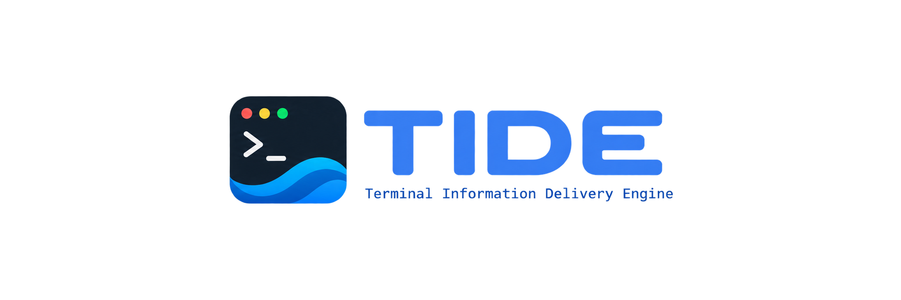

# TideGit

A calm, keyboard-first terminal Git client built with TideUI.
**Milestone 7: configuration, persistent state and an in-app Settings screen.**


Requires Git 2.32 or newer (for `git stash show --include-untracked`) and Go
1.26.1 or newer.

```sh
go run ./cmd/tidegit /path/to/repository
go build -o bin/tidegit ./cmd/tidegit
./bin/tidegit
./bin/tidegit -theme nord /path/to/repository
```

Without a path, TideGit discovers the repository containing the current directory.
Outside a repository it shows the Git discovery error and instructions to launch
with a path; the recent-repository picker belongs to a later milestone.

The Status screen groups staged, unstaged, untracked and conflicted files. A file
with both index and working-tree changes appears in both appropriate groups.
The right pane previews the selected state, including unified diff line numbers,
Git's hunk/function headers, binary notices, renames, deletions and combined
conflict diffs. Conflict diffs intentionally retain Git's multi-parent columns.
Stage or unstage complete files or individual text hunks. Working-tree content
is preserved by all staging actions. A whole-file operation follows the selected
path into its destination group; a hunk operation stays with the remaining hunks
in the current group when possible.

TideGit has eight screens: **Status** (`1`), **History** (`2`), **Branches**
(`3`), **Stash** (`4`), **Remotes** (`5`), **Conflicts** (`6`), **Reflog** (`7`)
and **Settings** (`8`). `Ctrl-P` opens the command palette, `?` shows the
bindings that act on the screen you are looking at, and `q` steps back to
Status before it quits.

TideGit works with no configuration at all. When you want to change something,
the Settings screen edits an app-managed overrides file and never rewrites your
hand-edited `config.toml`, so comments and layout survive.

Remote and stash work is never background plumbing: `f`, `p` and `P` run a
fetch, pull or push for the current repository from any screen, and a compact
chip in the header shows what is happening. Failures open an operation panel
with a plain-language explanation and the full Git output behind `e`.

When the repository is part-way through a merge, rebase, cherry-pick or revert,
the thin header rule becomes a state ribbon (`MERGE IN PROGRESS · 2 unresolved
conflicts`) instead of hiding the fact in a footer. The ribbon, the Status
screen and `git rev-parse`-style state files all agree, and a restart
rediscovers the operation from Git itself.

Press `c` to compose a commit or `A` to amend HEAD. The commit screen pairs a
Ripple editor with a staged review: file list, additions/deletions and a staged
diff preview. Git owns the message. Templates, `core.commentChar`,
`commit.cleanup`, hooks, signing and sign-off all behave as they do on the
command line. TideGit records what you reviewed: if the index or HEAD changes
between review and submission, the commit is refused until you refresh with
`Ctrl-R`. A rejected commit keeps your draft, and `F6` shows Git's own output.

| Key | Action |
| --- | --- |
| Tab / Shift-Tab | Next / previous pane |
| j / k, Up / Down | Navigate sections/files or scroll the diff |
| h / l, Left / Right | Scroll the diff horizontally |
| PageUp / PageDown, Home / End | Page or jump within the focused pane |
| Enter | Focus next pane |
| / | Filter the current file section; Enter keeps, Escape clears |
| s / u | Stage / unstage the selected **file** |
| S / U | Stage / unstage the selected **hunk** |
| [ / ] | Previous / next hunk; the active header is marked `>` |
| c / A | Compose a commit / amend HEAD |
| 1 / 2 / 3 | Status / History / Branches |
| 4 / 5 | Stash / Remotes |
| 6 / 7 | Conflicts / Reflog |
| 8 | Settings |
| f / p / P | Fetch / pull / push the current branch |
| o | Show the last operation's details |
| Ctrl-P | Command palette |
| t | Theme picker |
| r / Ctrl-R | Refresh status and selected diff |
| z | Expand / restore focused pane |
| ? | Contextual help |
| q | Close help/expanded view, otherwise quit |
| Ctrl-C | Quit |

### Commit screen

| Key | Action |
| --- | --- |
| Ctrl-S | Commit (runs hooks and signing) |
| Ctrl-O | Toggle `Signed-off-by` |
| Ctrl-R | Re-read the staged review, keeping your draft |
| Tab | Switch between the editor and the staged review |
| j / k | Choose a staged file to preview (review pane) |
| F6 | Show Git's output from the last failure |
| F1 | Commit and editor guide |
| Esc / Ctrl-Q | Return to Status; an edited draft asks first (Ctrl-D discards) |

Ripple owns editing: arrows move, Shift-arrows select, Ctrl-Z / Ctrl-Y undo and
redo, Ctrl-C / Ctrl-X / Ctrl-V copy, cut and paste through the system clipboard
(`pbcopy`, `wl-copy` or `xclip`). Because Ctrl-C is copy here, it does not quit;
leave with Esc first. The one exception is while Git is running: a commit has no
deadline, so Ctrl-C during hooks or signing leaves TideGit rather than trapping
you behind an unattended prompt.

Small terminals use TideUI's tabbed layout. Mouse input is not enabled.

## Themes

Press `t` on any screen for the theme picker: moving the cursor previews the
whole app in that palette, `Enter` keeps it, `Esc` puts back the one you had.
`-theme NAME` picks one at launch, and the command palette has the same two
entries.

Besides TideUI's built-in palettes there is **`match-omarchy`**, which follows
the desktop's current [Omarchy](https://omarchy.org) theme instead of carrying
colours of its own:

```sh
./bin/tidegit -theme match-omarchy
```

It reads the active theme from `~/.local/state/omarchy/current/`, preferring
Omarchy's own `omarchy-theme-color` resolver and falling back to parsing the
theme's `colors.toml` / `alacritty.toml`. While it is selected TideGit polls for
desktop theme changes every two seconds and follows them, so changing your
desktop theme recolours the running app. Where Omarchy is not installed the
name still works and falls back to a built-in palette.

A desktop palette is chosen for a desktop, not for a dense terminal UI, so it is
run through TideUI's contrast correction before use: text, accents and the
status bar are each lifted until they clear a readability floor against the
theme's own background. Colours that already pass are left exactly as they are.

The chosen theme lasts for the session — TideGit has no configuration file yet,
so use `-theme` for a lasting default.

## History

The History screen walks refs on the left, draws the commit graph in the middle
and inspects the selected commit on the right.

The graph is drawn from real topology, not decoration: lanes are assigned from
each commit's parents, a lane keeps its column for as long as a commit is still
expected in it, and merges and forks are drawn where they actually happen.

| Glyph | Meaning |
| --- | --- |
| `●` | commit |
| `◆` | merge commit |
| `○` | first commit — no parents |
| `◉` | the commit HEAD points at |
| `┃ ━ ╭ ╮ ╰ ╯ ╋ ┳ ┻` | lanes, forks, merges, crossings and tees |

Lines use Unicode's heavy box-drawing set with light arcs for the corners. The
weight is what makes a lane read as a continuous line rather than a column of
dots, which is what the colours below need in order to say anything; the arcs
keep the turns soft against the rounded panes. Unicode has no heavy arc, so a
corner is lighter than the lines it joins — at a terminal's cell size that reads
as a taper into the turn. A plain theme falls back to ASCII (`| - + * %`).

Each line of development is drawn in its own colour, and keeps it for as long as
that line exists — across every row it passes through, even where it changes
column — so a branch can be followed down the page at a glance. A column reused
by a later branch gets a new colour rather than inheriting the finished one.
Where a commit reaches sideways, the horizontal run takes that commit's colour
while a lane it crosses keeps its own, so the two readings stay separable.

The colours are rotations of the theme's own accent, corrected until each clears
a contrast floor against whatever it is drawn on — including the selection
background, so selecting a row never hides the topology under it. A theme with
no hue variety of its own, like the amber VT52 or the green VT100, is left
monochrome: inventing colour for it would destroy the thing that makes it that
theme.

Refs are compact badges that carry a text signal as well as a colour, so they
stay readable in a plain terminal: `@ main` is where HEAD is, `# v1.0` is a tag,
`origin/main` is a remote-tracking branch, and a bare name is a local branch.
Badges that do not fit become `+2`.

The inspector shows the full hash, author and committer with their dates, the
parents, the message, the refs, and the changed files with per-file counts.
Enter on a changed file opens that commit's patch in the working-tree diff
viewer, labelled `Commit <hash>` so it is never mistaken for staged state.

History loads 120 commits at a time and asks for more as the selection nears the
end of the list. Filtering by ref, searching subjects and inspecting commits all
run through Git; nothing is filtered by loading the whole history into memory.

| Key | Action |
| --- | --- |
| j / k | Move through refs, commits or changed files |
| Tab | Refs → commits → inspector |
| Enter | Focus the next pane, or open the selected file's patch |
| / | Search commit subjects |
| n | Create a branch at the selected commit |
| y | Copy the full commit hash |
| Esc | Leave the patch and return to the commit |

## Branches

The Branches screen lists local and remote-tracking branches with the current
branch marked `@`, ahead/behind counts, and `✓` for a branch level with its
upstream. The middle pane shows the selected branch's own history; the inspector
gives its target, tip commit, upstream, merge state against HEAD and merge base.
Ahead/behind appears as `↑ 3  ↓ 1` **and** in words, so the arrows are never the
only cue.

| Key | Action |
| --- | --- |
| Enter / s | Switch to the selected local branch |
| n | Create a branch from the selection (Ctrl-S also switches to it) |
| R | Rename a local branch |
| D | Delete a local branch, after confirming |
| / | Filter the branch list |
| y | Copy the branch's target hash |

Switching uses `git switch` and nothing else: if you have local work that the
switch would overwrite, Git refuses and TideGit shows why, leaving your working
tree untouched. Deleting asks first and uses Git's safe delete. If Git refuses
because the branch holds unmerged commits, that refusal becomes a second,
differently worded question with a different key — nothing escalates to a forced
delete on its own.

Remote-tracking branches are read-only here: they can be inspected and branched
from, but not switched to, renamed or deleted.

## Remotes

The Remotes screen reads Git's own configuration — no ad-hoc parsing of display
strings — and shows each remote's fetch and push URLs, its remote-tracking
branches, the local branches that track them, and the last recorded fetch. URLs
are the noisiest fact, so they come last and are styled as secondary metadata.

| Key | Action |
| --- | --- |
| j / k | Choose a remote |
| f | Fetch the selected remote |
| F | Fetch all remotes |
| p / P | Pull the current branch / push the current branch |
| / | Filter remotes |

`f` on any screen fetches the resolved default remote: `remote.pushDefault`,
then the current branch's remote, then `origin`, then the only remote. When the
choice is genuinely ambiguous TideGit asks which remote rather than guessing. A
single fetches one remote; `F` is the only path that uses `--all`.

Fetch updates remote-tracking refs and then refreshes branch tracking,
ahead/behind, history refs and the working-tree snapshot, keeping the current
screen and selection. Fetch and push can be cancelled with `Esc`; Git is killed
cleanly and the cancellation is reported.

```sh
./bin/tidegit -theme nord /path/to/repository
```

## Pull and push

Pull runs ordinary `git pull` and respects `pull.rebase`, `pull.ff`,
`branch.<name>.rebase` and every other Git setting. TideGit does not invent a
merge or rebase strategy: if the configuration is ambiguous, Git's own refusal
is shown with the strategy it needs. The common states are named rather than
flattened into "pull failed": already up to date, fast-forward, merge, conflict,
divergent branches, no upstream, detached HEAD, and a dirty working tree that
would be overwritten.

Push respects `push.default`, `remote.pushDefault`, branch upstream
configuration and signing. With an upstream it runs plain `git push`, so Git
decides the refspec. Without one it offers **Push and set upstream** explicitly,
choosing the remote only when it is unambiguous. A rejected non-fast-forward
push is explained and the local branch is left untouched. Force pushing is
deliberately not bound to a key and is not part of this milestone.

Remote failures carry both meaning and detail: authentication, host unreachable,
DNS, permission denied, remote not found, protected branch, non-fast-forward,
missing upstream and Git's pull-strategy demand each get their own wording while
the underlying Git and SSH output stays available in the operation panel under
`e`, with `r` to retry where rerunning is safe.

Authentication is Git's: SSH agent, SSH config, credential helpers and system
configuration all keep working. TideGit sets no custom credential manager and
stores nothing; it disables Git's own terminal prompt so an operation cannot
hang behind a prompt it cannot show, and reports the authentication failure.

## Stash

The Stash screen lists each entry with its selector, source branch, message and
age; the middle pane lists the files it changes and the right pane shows the
selected file's patch through the same renderer the working tree uses, labelled
`Stash stash@{0}` so it can never be mistaken for staged state.

| Key | Action |
| --- | --- |
| j / k | Move through stashes |
| a / p / d | Apply / pop / drop the selected stash |
| n / N | Stash tracked changes / include untracked files |
| Enter | Reach the file list, then the patch |
| / | Filter stashes |

Creation uses Git's own stash: the message is optional and `N` adds `-u`.
Applying keeps the entry; popping removes it only after Git reports success. A
conflicted apply or pop is surfaced, the stash is preserved exactly as Git
leaves it, and the user is directed to Status to resolve it — TideGit never
drops a stash on Git's behalf. Dropping is destructive and always asks first,
naming the entry in the question. Because `stash@{0}`, `stash@{1}` and their
neighbours shift after any mutation, the list is reloaded afterward and the
selection is restored by the stash's commit id rather than by a stale index.

## Conflicts

The Conflicts screen treats an unmerged repository as a set of questions, not an
emergency. Files are grouped by Git's own conflict kind — both modified, both
added, deleted by us, deleted by them, added by us, added by them, both deleted
— read from the structured `UU`/`AA`/`DU`/`UD`/`AU`/`UA`/`DD` status codes rather
than by scanning text. Each row shows its path, group and the number of conflict
regions in the working file.

| Key | Action |
| --- | --- |
| j / k | Move through unmerged files |
| [ / ] | Previous / next conflict region |
| v | Cycle the inspector: region, working result, ours ↔ base, theirs ↔ base |
| o / t | Write ours / theirs into the file (leaves it unmerged) |
| O / T | Write ours / theirs and mark resolved |
| b | Keep both sides |
| m | Mark resolved |
| e | Open the file in `$VISUAL`/`$EDITOR` |
| c / x / A | Continue / skip / abort the operation |
| / | Filter files |

The middle pane lists the conflict regions parsed from the file's markers
(`<<<<<<<`, `|||||||` in diff3 style, `=======`, `>>>>>>>`), and the inspector
shows one region with explicit `OURS`, `THEIRS` and `BASE` labels. The labels
follow the operation: during a rebase they read `UPSTREAM` and `YOUR COMMIT`,
because "ours" and "theirs" swap meaning there and the words should not. The
stages themselves come from the index (`ls-files --unmerged` and the stage
blobs), so the comparison is exact, and the two stage comparisons are rendered
through the same diff renderer the rest of the app uses.

Writing a side never marks a file resolved on its own; the uppercase keys do
both because they say so. Keep both is a literal concatenation of the two sides,
not a semantic merge, and is left unstaged for the user to edit. An external
editor is launched through the terminal hand-off, and returning only refreshes
the file — markers that remain keep the file unmerged. Marking resolved is
`git add`, so the index stays the single source of truth.

## Recovery

A paused operation can be continued, skipped or aborted. Continue is Git's own
`merge --continue`/`rebase --continue`/`cherry-pick --continue`/`revert
--continue`, so unresolved files block it with Git's wording rather than
bypassing the check. Abort always confirms, and the question says exactly what
will be restored. When the last conflict is resolved the screen stops asking for
resolution and offers the one next action — continue the operation.

The Reflog screen is the recovery timeline, presented as first-class history
rather than raw command output: selector, short hash, the action Git recorded
(`reset: moving to HEAD~1`, `commit`, `checkout`, `commit (amend)`), its subject,
and the reflog entry's own timestamp.

| Key | Action |
| --- | --- |
| j / k | Move through the timeline |
| Enter | Inspect the entry; open a changed file's patch |
| b | Create a branch here — the safest recovery |
| R | Reset to this entry (soft, mixed or hard, confirmed) |
| s | Switch to this commit, detached (confirmed) |
| y | Copy the full hash |
| / | Filter entries |

Creating a recovery branch is the prominent action because it keeps work
reachable without moving HEAD. Reset spells out the three modes before asking:
soft keeps the index and working tree, mixed keeps the working tree but resets
the index, and hard discards tracked working-tree changes and requires a
stronger confirmation. Undo last commit offers only the two safe shapes — keep
the changes staged or keep them unstaged — and never "undo and discard".
Reverting a commit from History creates an inverse commit and leaves the
original in place, which is the right tool for shared history; reverting a merge
is refused rather than guessed at. Individual files can be restored from the
working tree, from HEAD, or from a selected commit, each with distinct wording.

Every destructive action is behind a confirmation that names the target and
states what changes and whether it is recoverable. Errors keep Git's own output
and add a sentence about what it means.

## Configuration

TideGit reads TOML from the XDG config directory:

- `$XDG_CONFIG_HOME/tidegit/config.toml`, falling back to
  `~/.config/tidegit/config.toml`.

Persistent state lives separately, under
`$XDG_STATE_HOME/tidegit/state.toml` or `~/.local/state/tidegit/state.toml`.

The config file is optional. Every setting has a sensible default, and an
absent file, an absent directory or a file that only sets one value all work.
A hand-written config is a set of overrides, not a complete file:

```toml
version = 1

[appearance]
theme = "nord"
compact = false

[diff]
context_lines = 5

[git]
history_page_size = 200
```

`config.toml` is never rewritten by the app. In-app changes are stored in
`overrides.toml` beside it, so comments and formatting in the file you edit by
hand are always safe. The effective value is resolved in this order:

1. compiled defaults
2. `config.toml`
3. `overrides.toml` (in-app Settings changes)
4. `-theme` on the command line (session only, never persisted)
5. runtime changes made in the UI

Git's own settings — `user.name`, `pull.rebase`, `push.default`, credential
helpers, signing — remain Git's, read through Git.

### Invalid and unknown settings

A malformed or invalid config never stops TideGit. The errors, with the file
path, are printed to stderr and the defaults are used; a later reload keeps the
last valid configuration. Unknown keys are warnings, not failures, and a close
match is suggested:

```
Unknown setting: appearance.animatons (did you mean appearance.animations?)
```

`version` protects forward compatibility: a newer schema is refused with an
explanation rather than misread, and a migration seam exists for future
versions.

## Settings screen

The Settings screen is a first-class part of the application. Categories on the
left — Appearance, Layout, Diff, Editor, Behavior, Git, Remote, Keybindings —
lead to their settings in the middle, and the inspector on the right explains
what a setting does, its current value, its default, where it came from, its
valid range, and whether it needs a restart. A setting that differs from the
default is marked with a `•` and a `modified` note.

| Key | Action |
| --- | --- |
| Enter | Edit or toggle the selected setting |
| ← / → | Adjust an integer or cycle an enum |
| x / X | Reset this setting / reset every in-app change (confirms) |
| / | Search names, categories and descriptions |
| E | Open `config.toml` in your editor |
| L | Reload configuration after a manual edit |
| V | Show the effective configuration with each value's source |

Appearance changes preview live: the theme picker repaints every screen, and
density, borders, icons and animations apply as you toggle them. Appearance
settings show a small preview built from the real TideUI rows and status bar,
not a mock-up. A theme chosen here is written to `overrides.toml`, so it
survives a restart.

Keybindings are edited by action id. Selecting a binding and pressing a key
captures it; conflicts and unknown action ids are reported, and any binding can
be reset to its default. Action ids are stable (`app.quit`, `git.commit`,
`view.history`, `repo.refresh`, …), so they are the same names used in the
config file and in the documentation.

Creating a config file is explicit: with no `config.toml` present, "Open config
in editor" offers to write a commented starter rather than dumping every
default. Reload and editor return both re-read the file, keeping the running
configuration if the new one is invalid.

## Persistent state

State is whatever is worth remembering but is not configuration: the last
repository, the bounded recent-repository list, the last screen and dismissed
hints. It has its own version and its own file, and corruption is never fatal —
TideGit starts fresh and keeps working. Configuration reset does not touch
state, and state does not change how the application behaves.

## A repository to try it on

TideGit is most legible against real history, so the repository it is pointed at
matters. `scripts/demo-repo.sh` builds a throwaway one with enough shape to
exercise every screen:

```sh
scripts/demo-repo.sh /tmp/tidegit-demo
./bin/tidegit /tmp/tidegit-demo
```

It produces roughly 300 commits over about 15 months from six authors, with
concurrent branch lanes, merges that criss-cross, an octopus merge with four
parents, a long-running `develop`, a release branch and a hotfix, branches left
unmerged, an orphan history with no merge base, lightweight and annotated tags,
two remotes at different distances (including one upstream that has been
deleted), a rename, a deletion, a binary file, a very long subject, a
multi-paragraph message and uncommitted working-tree changes.

The destination is deleted and rebuilt on every run, so point it somewhere
disposable. `TRUNK_COMMITS=600 scripts/demo-repo.sh …` makes a larger one.

## Validation

```sh
gofmt -w cmd internal
go vet ./...
go test -race ./...
go build -o bin/tidegit ./cmd/tidegit
```

Tests create isolated temporary repositories, disable user Git configuration for
fixtures, configure repository-local identity, and never stage or commit in your
own repositories. They cover status
transitions, special filenames, discovery failures, detached/unborn HEAD,
ahead/behind state, conflicts, binary and state-specific diffs, cancellation,
output bounds, stale UI responses, filtering, line numbers and terminal sizing.
Staging tests additionally cover file isolation, unborn HEAD, partial stage and
unstage, mixed state, newline/line-shift/empty-file edge cases, rename and copy
handling, metadata preservation, stale/malformed patches, index lock errors,
concurrent mutations and the complete UI action/refresh/selection workflow.
Commit tests cover message fidelity, hooks running in order, each hook rejection
keeping the repository and draft unchanged, amend with and without staged
changes, unborn HEAD, conflicts, merge commits with an unchanged tree, templates,
configured comment prefixes and cleanup, sign-off, signing remaining enabled,
stale index/HEAD refusals, the Git output panel, staged review navigation and
leaving a running commit.
History and branch tests cover linear history, merges, diverged branches, tags
on the right commits, remote-tracking refs, pagination, commit metadata and
changed-file parsing, the commit inspector and commit diff, graph topology and
lane stability, branch listing with upstream and ahead/behind, switching
(including a switch Git refuses), creation from HEAD, a commit and a tag,
renaming including the current branch, safe deletion, refused deletion of an
unmerged branch, detached HEAD, the command palette, and rendering at widths
from 160 down to 1 column in three themes.
Remote and stash tests use local bare repositories and second clones, never the
network. They cover remote parsing with one and several remotes, differing
fetch/push URLs, tracking branches and the ambiguous-default case; fetch
updating tracking refs without moving the local branch and recalculating
ahead/behind; fast-forward and already-up-to-date pulls, pull conflicts and a
dirty working tree Git refuses, and the exact classification of each; push,
first-push upstream setup, non-fast-forward rejection, and a classification for
unreachable hosts; stash create with tracked-only and untracked files, message
fidelity, listing and inspection, apply keeping the entry, pop removing it only
on success, drop removing only the selected entry, and a conflicted apply that
stays a conflict and preserves the stash. The UI tests drive fetch, pull, push
and every stash action through the real model and assert the operation panel,
missing-upstream choice, conflict surfacing, stash-index stability and
rendering of the new screens at ten sizes in three themes.
Conflict and recovery tests build merge, rebase, cherry-pick, revert, add/add
and modify/delete conflicts and verify operation detection, stage retrieval,
conflict kinds, region parsing (including diff3 line numbers and false-positive
rejection), side selection, keep-both, mark-resolved, continue/skip/abort,
reset in all three modes, revert success and conflict, file restore variants,
reflog parsing and recovery-branch creation, and that a fresh model rediscovers
an in-progress operation. The UI tests drive resolution, abort, the rebase side
labels, undo and revert, and the palette, and render the Conflicts and Reflog
screens at ten sizes.
Configuration tests cover XDG and fallback paths, defaults with a missing file,
partial-file merging, malformed TOML, invalid enums, ranges and keybindings,
unknown-key warnings with suggestions, a future version, the migration seam, and
separate state persistence including bounded recent repositories and corrupted
state. Store tests cover override precedence, minimal overrides files, comment
safety in `config.toml`, keybinding overrides, invalid-value rejection, corrupt
override recovery, manual-edit reload and keeping the last valid configuration.
UI tests cover the Settings screen, search, toggles, enum and integer controls,
changed indicators, reset and reset-all, keybinding capture, the effective
configuration view, an invalid config recovering after a fix, and rendering at
eight sizes.

## Scope and limits

Remote work covers listing and inspecting remotes, fetch, pull, push and
upstream setup. Force push, `fetch --prune`, tags, remote branch deletion and
remote repository creation are not exposed. Conflict work covers detection,
inspection, side selection, keep-both, external editing, mark-resolved and
continue/skip/abort for merge, rebase, cherry-pick and revert. Reset (soft,
mixed, hard), revert of a normal commit, file restore from the working tree, HEAD
or a commit, undo-last-commit, and reflog browsing and recovery are implemented.
AI conflict resolution, a full interactive rebase editor, commit squashing and
reordering, worktree and submodule management, forge integration, the repository
picker, clone, AI providers, a plugin system and config watching are not
implemented. Milestone 8 has not started.

Configuration hot reload is explicit (`L`) rather than a filesystem watcher, so
editors writing temporary files cannot cause repeated reloads. Per-repository
overrides are not implemented, but the layered loader is built so they can be
added without changing callers. Theme and keybinding changes apply immediately;
mouse input needs a restart. Persistent state currently covers the last and
recent repositories and the last screen; it does not store credentials, tokens
or drafts.

Remote refs are read as they are. Nothing contacts a network except fetch, pull
and push. Tags are rendered in history but there is no tag management. Branch
work covers local branches only — switch, create, rename and delete.

Network operations have no fixed deadline, because a large fetch or a slow host
is legitimate; they run until Git returns, and fetch and push can be cancelled
with `Esc`. Credentials are entirely Git's (SSH agent, SSH config, credential
helpers); TideGit stores none, and disables Git's interactive terminal prompt so
an operation cannot block on a prompt the UI cannot show.

Committing covers `git commit` and `--amend` of HEAD. Interactive rebase, fixup
and squash helpers, commit splitting, editing older commits, and resuming an
interrupted merge, rebase or cherry-pick are not exposed. Conflicted files block
a commit until they are resolved with Git. The commit screen reviews the index
TideGit read; it does not poll for external changes, so refresh with Ctrl-R if
another process stages something while you write.

Conflict resolution edits one file at a time and never performs a semantic
merge; keep-both is a literal concatenation. Reverting a merge commit needs a
parent choice and is refused. Bisect is detected and can be reset, but not
driven. Hard reset and destructive restores cannot be undone by TideGit itself;
they rely on the reflog, whose reach the confirmation states.

Hunk actions require a complete text preview. Binary files and metadata-only
changes use whole-file actions. Conflicted files and submodule staging are not
exposed by the UI. Line-level staging is deferred. A text hunk action does not
stage permission changes or undo a staged rename/copy; use whole-file actions
for that metadata. Git typically reports a rename performed outside the index
as a deleted path plus an untracked path: stage those paths individually to
record the rename, without implicitly staging another file.

Mutations run one at a time. While an operation and its status refresh run,
selection and additional mutations are held; focus, help, expansion and quit
remain available. Remote and stash mutations take the same per-repository lock
as staging, branch work and committing, so pull, push, branch switching, stash
popping and commits can never race one another. Errors include operation/path
context and Git stderr in the scrollable right pane. Refresh with `r` after
correcting an error.

Status, diff and commit-review commands run asynchronously with a 30-second
deadline. The commit itself has none: hooks, signing and pinentry may
legitimately wait, so it runs until Git returns or you leave with Ctrl-C. Captured
output is bounded to 4 MiB per stream. Oversized status results fail explicitly;
diffs show a limited preview (also capped at 20,000 displayed lines). Scrollable
diff data is prepared once in the background. Truncated previews cannot be used
for hunk staging. Git itself may still use substantial
resources calculating very large diffs before cancellation. Preview limits are
not a substitute for future large-repository profiling.

See [architecture](docs/architecture.md) for API reuse, decisions and future
seams, and the validation records for what was checked and how:
[Milestone 3](docs/milestone-3-validation.md),
[Milestone 4](docs/milestone-4-validation.md),
[Milestone 5](docs/milestone-5-validation.md),
[Milestone 6](docs/milestone-6-validation.md),
[Milestone 7](docs/milestone-7-validation.md).

---

<p align="center">
  
</p>
